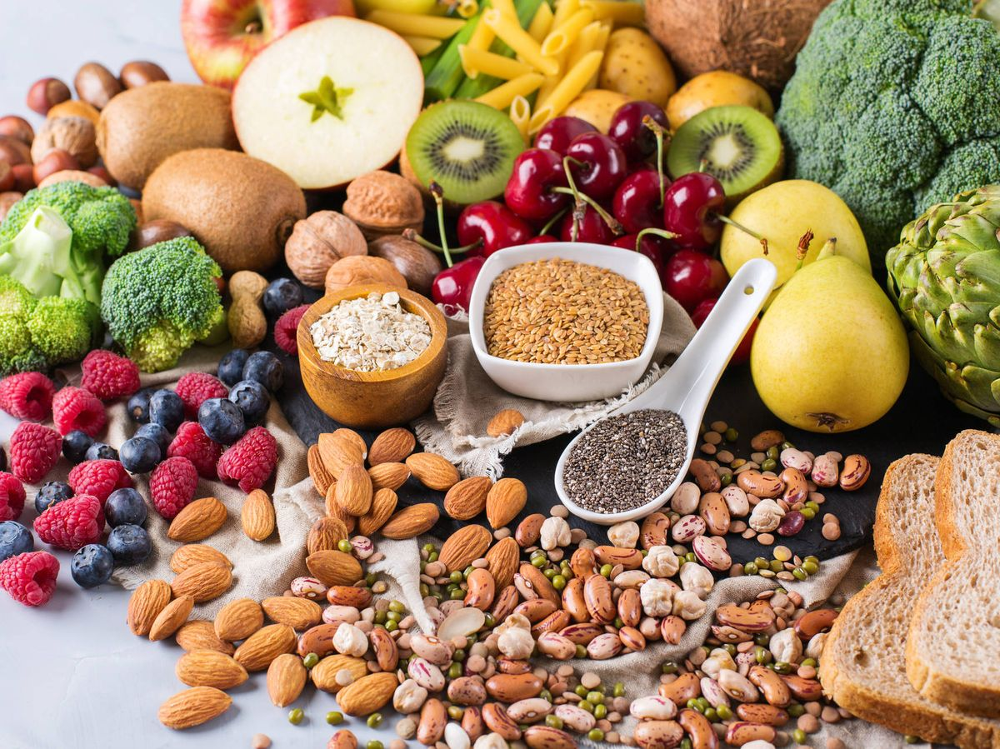

# Nutrients
# Food Nutrient Analysis

This repository contains a data analysis project focused on nutrient analysis of foods, with a focus on studying proteins, carbohydrates, and fats present in different types of foods. The main objective of this project is to provide a deep understanding of the nutritional composition of various foods and enable significant insights in terms of dietary habits and healthy choices.

## Contents

1. [Introduction](#introduction)
2. [Data](#data)
3. [Analysis](#analysis)
4. [Results](#results)
5. [Data Dictionary](#data-dictionary)
6. [Next steps](#next-steps)

## Introduction
Understanding the nutrients present in foods is crucial for making informed decisions about our diet and lifestyle. This project focuses on analyzing the amount of proteins, carbohydrates, and fats in different types of foods and how these values can impact our health and well-being.

## Data
The data used in this project comes from reliable sources of nutritional information for foods. The datasets contain detailed information about the nutrient composition of a wide variety of foods, enabling us to conduct accurate analysis.

## Analysis
In this project, we perform a comprehensive analysis of food nutrient data. Some of the highlighted aspects of the analysis include:

- *Nutrient Distribution* : We explore the distribution of proteins, carbohydrates, and fats across different food categories.
- *Comparison of Food Groups*: We compare the nutritional composition among different food groups, such as fruits, vegetables, dairy products, lean meats, etc.

## Results
Our analysis reveals valuable insights about the nutritional composition of foods:

- Proteins are particularly abundant in foods like lean meats, legumes, and dairy products.
- Carbohydrates are present in larger quantities in grains, fruits, and some vegetables.
- Fats vary based on the type of food and can be found in processed products, vegetable oils, and nuts.
These results can help individuals make informed decisions when selecting foods to meet their nutritional and health goals.

## Data Dictionary

Here, you can refer to a data dictionary that explains nutrition concepts. You can consult it whenever you have any doubts.

## Next Steps

In the future, potential steps include implementing a food search feature, conducting a study on vitamins, etc.

